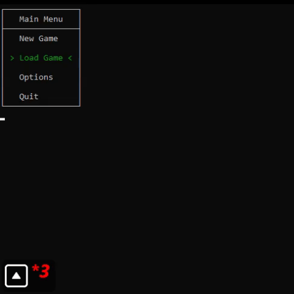

# Quoridor - Terminal Version (v2)

A fully redesigned version of the classic Quoridor board game, now with a modular architecture, dynamic terminal UI, and configuration menus — all written in C.

## Features

- Interactive menus with arrow-key control
- Dynamic piece and wall placement with hover preview
- AI players with adjustable difficulty
- Modular, clean, and maintainable codebase

## Demo

👉 [Watch full video](demo/demo.mp4)

## ⚠️ Known Issues

- AI turns (`handle_ai_turn`) not yet implemented
- Wall placement doesn't check if player path is blocked yet
- No winner check logic yet (`check_winner`)

## Build & Run
